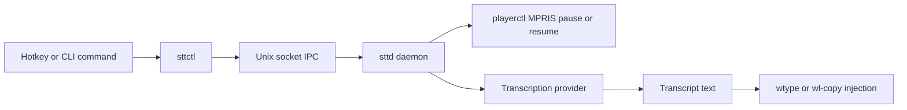

# saco-dictation-tool

Local-first speech-to-text dictation for Hyprland and Wayland desktops.

This workspace packages a long-running daemon, a control CLI, and shared protocol/config code. The daemon captures microphone audio, pauses active media playback before recording, sends audio to a transcription provider, and injects the transcript back into your desktop session by typing or clipboard.

## Table of Contents

- [What This Repository Contains](#what-this-repository-contains)
- [How It Works](#how-it-works)
- [Requirements](#requirements)
- [Quick Start](#quick-start)
- [Control Commands](#control-commands)
- [Configuration Overview](#configuration-overview)
- [Run as a systemd User Service](#run-as-a-systemd-user-service)
- [Development](#development)
- [Documentation Map](#documentation-map)
- [License](#license)

## What This Repository Contains

| Part | Path | Purpose |
| --- | --- | --- |
| `sttd` | `crates/sttd` | Hyprland-native dictation daemon that manages audio capture, playback coordination, transcription, and text injection. |
| `sttctl` | `crates/sttctl` | CLI for push-to-talk, continuous mode, status checks, replay, and shutdown. |
| `common` | `crates/common` | Shared config loader and local IPC protocol definitions used by both binaries. |

Key behaviors:

- Local IPC control plane over a Unix socket.
- Best-effort global playback auto-pause via `playerctl` and MPRIS.
- Multiple transcription backends: `whisper_local`, `whisper_server`, and `openrouter`.
- Multiple output backends: typed text, clipboard copy, or clipboard copy with autopaste.
- Guardrails for cooldowns, rate limits, continuous mode limits, and optional soft-spend controls.
- Transcript retention and replay when output injection fails.

## How It Works

The following diagram shows the normal dictation path through the workspace.



`sttd` accepts a recording request immediately, pauses currently playing media, starts audio capture once the playback gate finishes or times out, transcribes the utterance, and then injects the transcript into the focused application.

## Requirements

- Linux desktop environment with Wayland-oriented input tooling.
- Rust `1.85` and Cargo.
- `uv` for local workflow sync.
- One transcription backend:
  - `whisper-cli` for `whisper_local`
  - `whisper-server` for `whisper_server`
  - an OpenRouter API key for `openrouter`
- `wtype` for typed output mode.
- `wl-copy` for clipboard-based output modes.
- `playerctl` if you want automatic playback pause and resume.
- `systemd --user` if you want to run the daemon as a user service.

## Quick Start

### 1. Sync local tooling

```bash
uv sync --all-extras
```

### 2. Create your config files

```bash
mkdir -p ~/.config/sttd
cp config/sttd.example.toml ~/.config/sttd/sttd.toml
cp config/sttd.env.example ~/.config/sttd/sttd.env
```

### 3. Choose a transcription provider

The default configuration uses `whisper_local`. Adjust `~/.config/sttd/sttd.toml` and `~/.config/sttd/sttd.env` as needed:

- `whisper_local`: set `whisper_cmd` and `whisper_model_path`.
- `whisper_server`: set `provider.kind = "whisper_server"` and a `base_url`.
- `openrouter`: set `provider.kind = "openrouter"` and provide `STTD_OPENROUTER_API_KEY`.

### 4. Build and start the daemon

```bash
cargo build --release -p sttd
cargo build --release -p sttctl
cargo run -p sttd -- --config ~/.config/sttd/sttd.toml
```

### 5. Control the daemon from another terminal

```bash
cargo run -p sttctl -- status
cargo run -p sttctl -- ptt-press
cargo run -p sttctl -- ptt-release
```

For continuous dictation:

```bash
cargo run -p sttctl -- toggle-continuous
cargo run -p sttctl -- toggle-continuous
```

## Control Commands

`sttctl` currently supports these commands:

| Command | What it does |
| --- | --- |
| `ptt-press` | Starts a push-to-talk recording session. |
| `ptt-release` | Stops the current push-to-talk session and triggers transcription. |
| `toggle-continuous` | Turns continuous dictation on or off. |
| `replay-last-transcript` | Re-injects the last retained transcript after an output failure. |
| `status` | Prints daemon state, protocol version, guardrail counters, and retained transcript state. |
| `shutdown` | Stops the daemon cleanly. |

Useful examples:

```bash
cargo run -p sttctl -- status
cargo run -p sttctl -- replay-last-transcript
cargo run -p sttctl -- shutdown
```

## Configuration Overview

`sttd` loads settings from `sttd.toml`, then applies environment overrides from `sttd.env`.

### Provider modes

| Value | Use when | Notes |
| --- | --- | --- |
| `whisper_local` | You want local CLI-based transcription. | Uses `whisper-cli` and a local model file. |
| `whisper_server` | You want persistent local inference over HTTP. | Targets `POST /inference` on the configured `base_url`. |
| `openrouter` | You want a hosted backend. | Requires `STTD_OPENROUTER_API_KEY`. |

### Output modes

| Value | Behavior |
| --- | --- |
| `type` | Types text into the focused window with `wtype`. |
| `clipboard` | Copies text to the clipboard with `wl-copy`. |
| `clipboard_autopaste` | Copies text and then pastes it. |

### Other important sections

- `[playback]` controls whether `sttd` pauses active players and how long it waits for `playerctl`.
- `[guardrails]` limits request rate, continuous mode duration, provider cooldown, and optional spending.
- `[audio]` and `[vad]` tune capture and utterance segmentation.
- `[privacy]` controls log redaction and transcript persistence.
- `[debug_wav]` enables bounded WAV capture for troubleshooting.

See [config/sttd.example.toml](./config/sttd.example.toml) and [config/sttd.env.example](./config/sttd.env.example) for the full template.

## Run as a systemd User Service

Install the daemon service:

```bash
cp config/sttd.service ~/.config/systemd/user/sttd.service
systemctl --user daemon-reload
systemctl --user enable --now sttd.service
systemctl --user status sttd.service
```

If you use `whisper_server`, you can also install the companion service:

```bash
cp config/whisper-server.service ~/.config/systemd/user/whisper-server.service
systemctl --user daemon-reload
systemctl --user enable --now whisper-server.service
systemctl --user status whisper-server.service
```

The service units expect:

- `~/.config/sttd/sttd.toml`
- `~/.config/sttd/sttd.env`
- `sttd` to be available on your `PATH`

## Development

Common local commands:

```bash
uv sync --all-extras
cargo test
cargo test -p sttd
cargo build --release -p sttd
cargo build --release -p sttctl
```

Contributor notes:

- The workspace uses Rust 2024 edition and forbids unsafe code.
- Runtime contracts are covered by integration tests under `crates/sttd/tests`.
- Protocol compatibility matters across `common`, `sttd`, and `sttctl`.
- Playback coordination, provider adapters, and state-machine transitions are the highest-risk change areas.

## Documentation Map

Use the generated docs set when you need more depth than this README:

- [docs/index.md](./docs/index.md) for the documentation entry point.
- [docs/project-overview.md](./docs/project-overview.md) for the repo summary.
- [docs/architecture-sttd.md](./docs/architecture-sttd.md) for daemon internals.
- [docs/api-contracts-sttd.md](./docs/api-contracts-sttd.md) for IPC and provider contracts.
- [docs/deployment-guide.md](./docs/deployment-guide.md) for service deployment details.
- [docs/contribution-guide.md](./docs/contribution-guide.md) for contribution-specific guidance.

## License

This workspace is licensed under the MIT License.
