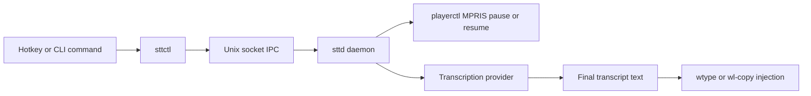

# saco-dictation-tool

Local-first speech-to-text dictation for Hyprland and Wayland desktops.

This workspace packages a long-running daemon, a control CLI, and shared protocol/config code. The daemon captures microphone audio, pauses active media playback before recording, sends audio to a transcription provider, and injects the final transcript back into your desktop session by typing or clipboard.

## Table of Contents

- [What This Repository Contains](#what-this-repository-contains)
- [How It Works](#how-it-works)
- [Requirements](#requirements)
- [Quick Start](#quick-start)
- [Configuration Overview](#configuration-overview)
- [Benchmarking](#benchmarking)
- [Run as a systemd User Service](#run-as-a-systemd-user-service)
- [Development](#development)
- [Documentation Map](#documentation-map)
- [License](#license)

## What This Repository Contains

| Part | Path | Purpose |
| --- | --- | --- |
| `sttd` | `crates/sttd` | Hyprland-native dictation daemon that manages audio capture, playback coordination, transcription, and text injection. |
| `sttctl` | `crates/sttctl` | CLI for push-to-talk, continuous mode, status checks, replay, and shutdown. |
| `common` | `crates/common` | Shared config loader and local IPC protocol definitions used by both binaries. |

Key behaviors:

- Local IPC control plane over a Unix socket.
- Best-effort global playback auto-pause via `playerctl` and MPRIS.
- Multiple transcription backends: `openai_compatible`, legacy `openrouter`, `whisper_local`, and `whisper_server`.
- Multiple output backends: typed text, clipboard copy, or clipboard copy with autopaste.
- Guardrails for cooldowns, rate limits, continuous mode limits, and optional soft-spend controls.
- Transcript retention and replay when output injection fails.

## How It Works



`sttd` accepts a recording request immediately, pauses currently playing media, starts audio capture once the playback gate finishes or times out, transcribes the utterance, and injects only the final transcript.

## Requirements

- Linux desktop environment with Wayland-oriented input tooling.
- Rust `1.85` and Cargo.
- `uv` for local workflow sync.
- One transcription backend:
  - a hosted OpenAI-compatible provider such as DashScope `qwen3-asr-flash`
  - `whisper-cli` for `whisper_local`
  - `whisper-server` for `whisper_server`
- `wtype` for typed output mode.
- `wl-copy` for clipboard-based output modes.
- `playerctl` if you want automatic playback pause and resume.
- `systemd --user` if you want to run the daemon as a user service.

## Quick Start

### 1. Sync local tooling

```bash
uv sync --all-extras
```

### 2. Create your config files

```bash
mkdir -p ~/.config/sttd
cp config/sttd.example.toml ~/.config/sttd/sttd.toml
cp config/sttd.env.example ~/.config/sttd/sttd.env
```

### 3. Choose a transcription provider

The shipped example config is ready for DashScope `qwen3-asr-flash` through the canonical hosted provider contract:

- set `STTD_PROVIDER_API_KEY` in `~/.config/sttd/sttd.env`
- keep `provider.kind = "openai_compatible"`
- keep `request_mode = "chat_completions"`
- keep `capability_probe = false` for the DashScope path

Other provider choices:

- `whisper_local`: set `provider.kind = "whisper_local"`, comment out `language_hints` and `request_mode`, and point `whisper_model_path` at a local model.
- `whisper_server`: set `provider.kind = "whisper_server"` and a `base_url`.
- `openrouter`: still supported as a compatibility alias, but prefer `openai_compatible` plus canonical hosted env names for new configs.

### 4. Build and start the daemon

```bash
cargo build --release -p sttd
cargo build --release -p sttctl
cargo run -p sttd -- --config ~/.config/sttd/sttd.toml
```

### 5. Control the daemon from another terminal

```bash
cargo run -p sttctl -- status
cargo run -p sttctl -- ptt-press
cargo run -p sttctl -- ptt-release
```

For continuous dictation:

```bash
cargo run -p sttctl -- toggle-continuous
cargo run -p sttctl -- toggle-continuous
```

## Configuration Overview

`sttd` loads settings from `sttd.toml`, then applies environment overrides from `sttd.env`.

### Provider modes

| Value | Use when | Notes |
| --- | --- | --- |
| `openai_compatible` | You want a hosted backend such as DashScope Qwen or another OpenAI-compatible STT provider. | Canonical hosted provider kind. |
| `openrouter` | You have an existing OpenRouter config. | Legacy-compatible alias routed through the same hosted implementation. |
| `whisper_local` | You want local CLI-based transcription. | Uses `whisper-cli` and a local model file. |
| `whisper_server` | You want persistent local inference over HTTP. | Targets `POST /inference` on the configured `base_url`. |

### Hosted provider fields

- Canonical TOML/env names are `provider.api_key`, `provider.language_hints`, `provider.request_mode`, `STTD_PROVIDER_API_KEY`, `STTD_PROVIDER_BASE_URL`, `STTD_PROVIDER_MODEL`, `STTD_PROVIDER_LANGUAGE`, `STTD_PROVIDER_LANGUAGE_HINTS`, and `STTD_PROVIDER_REQUEST_MODE`.
- Deprecated aliases remain supported: `provider.openrouter_api_key`, `STTD_OPENROUTER_API_KEY`, `STTD_OPENROUTER_MODEL`, and `STTD_OPENROUTER_LANGUAGE`.
- Precedence is `runtime canonical > runtime legacy > env-file canonical > env-file legacy > TOML canonical > TOML legacy`.
- Blank canonical or legacy hosted API keys are treated as unset before precedence resolution, so empty higher-priority values do not hide a lower-priority secret.

### Language defaults

- `provider.language` now defaults to unset instead of forcing English.
- That change affects both hosted providers and local Whisper runs.
- For bilingual English/Mandarin hosted benchmarking, prefer `provider.language_hints = ["zh", "en"]`.
- To reproduce the historical pre-change local Whisper baseline, explicitly set `provider.language = "en"` and keep an English-only `.en` model.

### Output modes

| Value | Behavior |
| --- | --- |
| `type` | Types text into the focused window with `wtype`. |
| `clipboard` | Copies text to the clipboard with `wl-copy`. |
| `clipboard_autopaste` | Copies text and then pastes it. |

See [config/sttd.example.toml](./config/sttd.example.toml) and [config/sttd.env.example](./config/sttd.env.example) for the full template.

## Benchmarking

The Phase 1 benchmark procedure lives in [_bmad-output/implementation-artifacts/qwen3-asr-flash-benchmark-2026-03-11.md](./_bmad-output/implementation-artifacts/qwen3-asr-flash-benchmark-2026-03-11.md).

Use that artifact to record:

- the fixed 9-utterance English / Mandarin / mixed benchmark matrix
- raw transcript output for each utterance
- end-to-end latency from stop event or VAD flush to successful transcript injection completion
- approximate per-request cost

Compare two paths:

- the historical pre-change local Whisper baseline with `provider.language = "en"`
- the DashScope `qwen3-asr-flash` hosted path with `request_mode = "chat_completions"`

## Run as a systemd User Service

Install the daemon service:

```bash
cp config/sttd.service ~/.config/systemd/user/sttd.service
systemctl --user daemon-reload
systemctl --user enable --now sttd.service
systemctl --user status sttd.service
```

If you use `whisper_server`, you can also install the companion service:

```bash
cp config/whisper-server.service ~/.config/systemd/user/whisper-server.service
systemctl --user daemon-reload
systemctl --user enable --now whisper-server.service
systemctl --user status whisper-server.service
```

## Development

Common local commands:

```bash
uv sync --all-extras
cargo test
cargo test -p sttd
cargo build --release -p sttd
cargo build --release -p sttctl
```

Contributor notes:

- The workspace uses Rust 2024 edition and forbids unsafe code.
- Runtime contracts are covered by integration tests under `crates/sttd/tests`.
- Protocol compatibility matters across `common`, `sttd`, and `sttctl`.
- Provider contract, playback lifecycle, and final-transcript injection are the highest-risk change areas.

## Documentation Map

- [docs/index.md](./docs/index.md) for the documentation entry point.
- [docs/project-overview.md](./docs/project-overview.md) for the repo summary.
- [docs/architecture-sttd.md](./docs/architecture-sttd.md) for daemon internals.
- [docs/api-contracts-sttd.md](./docs/api-contracts-sttd.md) for IPC and provider contracts.
- [docs/development-guide-sttd.md](./docs/development-guide-sttd.md) for daemon-specific setup and validation.
- [docs/deployment-guide.md](./docs/deployment-guide.md) for service deployment details.

## License

This workspace is licensed under the MIT License.
