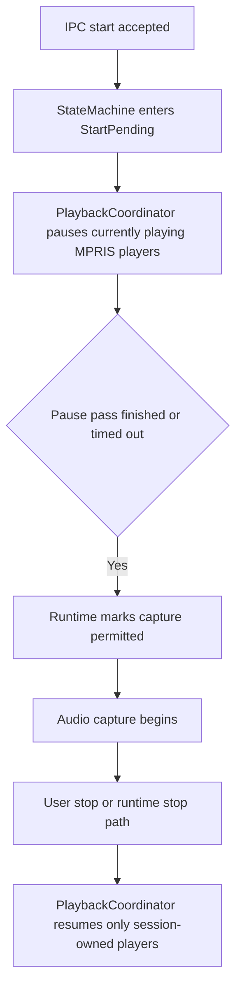

# Architecture - sttd (Exhaustive)

## Executive Summary

`sttd` is a long-running Rust daemon that orchestrates dictation capture, bounded playback coordination, transcription provider calls, and transcript output delivery with explicit runtime guardrails and recovery paths.

## Technology Stack

- Rust 2024 + tokio runtime
- Audio: cpal/hound
- Provider transport: reqwest + multipart
- Serialization/contracts: serde/serde_json/toml
- Observability: tracing
- Shared contracts: `common`
- Desktop playback control: `playerctl` via MPRIS, executed with bounded `tokio::process::Command`

## Architecture Pattern

- Service-centric daemon with asynchronous worker loop
- Adapter-based provider abstraction (`openrouter`, `whisper_local`, `whisper_server`)
- IPC boundary over Unix sockets
- Stateful orchestration via `StateMachine`
- Gated recording lifecycle: accepted start requests become `StartPending`, and capture begins only after the playback gate opens or times out

## Data Architecture

- In-memory runtime state machine (no persistent DB)
- In-memory playback ownership state for the current recording session only
- Versioned IPC contract envelope
- Config + env overlay with strict validation
- Optional bounded debug artifacts on filesystem

## API Design

Primary API surface is local IPC command protocol:

- Commands: PTT control, continuous mode toggle, status, replay, shutdown
- Response modes: ACK / status payload / typed error payload
- Protocol guard: incompatible version returns explicit protocol error

Behavior notes:

- Recording start ACKs remain immediate; the runtime worker enforces the playback gate before audio capture begins.
- `status` reports the destination active mode while the playback gate is unresolved and does not expose paused-player ownership.
- `replay-last-transcript` remains blocked until the daemon returns to `Idle`.

Provider-facing outbound APIs:

- OpenRouter `/audio/transcriptions` (+ `/chat/completions` fallback)
- whisper_server `/inference`
- whisper_local process contract (`whisper-cli`)

## Component Overview

### Runtime Entry and Loop

- `main.rs`: bootstraps config, provider validation, playback coordinator, worker tasks, IPC server, and shutdown cleanup

### Playback Coordination

- `playback.rs`: enumerates current MPRIS players, pauses the `Playing` snapshot, tracks only successful pauses, and resumes only session-owned players on stop or shutdown

### Audio Pipeline

- `audio/capture.rs`: device selection, capture, recoverable failure detection
- `audio/format.rs`: resample and downmix to 16 kHz mono PCM16
- `VadSegmenter`: utterance segmentation in continuous mode

### Provider Layer

- `provider/mod.rs`: shared trait and error taxonomy
- `openrouter.rs`: multipart STT + chat fallback heuristics
- `whisper_local.rs`: local binary execution contract
- `whisper_server.rs`: persistent inference endpoint contract

### IPC Layer

- `ipc/server.rs`: socket lifecycle, command dispatch, replay handling, and runtime transition notifications
- `ipc/mod.rs`: client `send_request` helper

### Output Injection

- `injection/mod.rs`: backend selection and fallback
- `wtype.rs`, `clipboard.rs`: backend adapters

### Runtime State

- `state.rs`: transitions, recording session phases (`StartPending`, `Active`), cooldowns, rate limits, soft spend guards, and pending push-to-talk capture handling

## Recording Lifecycle

The following flowchart shows how accepted recording requests are gated on playback coordination before capture begins.



## Source Tree (Part)

```text
crates/sttd/
├── src/
│   ├── audio/
│   ├── injection/
│   ├── ipc/
│   ├── provider/
│   ├── debug_wav.rs
│   ├── main.rs
│   ├── playback.rs
│   └── state.rs
└── tests/
```

## Development Workflow

- Configure provider, audio, injection, and playback behavior via TOML + env templates.
- Run daemon with an explicit config path.
- Use `sttctl` for control and status checks.
- Validate with integration tests under `crates/sttd/tests`.

## Deployment Architecture

- systemd user service (`sttd.service`) as primary deployment contract
- optional `whisper-server.service` for persistent local inference
- unit hardening directives limit privilege and scope

## Testing Strategy

- IPC flow and replay behavior tests
- Mode transition and guardrail tests
- Playback coordinator timeout, ownership, and shutdown cleanup tests
- Provider contract and fallback tests
- Device recovery behavior tests
- Service and release-doc contract tests
